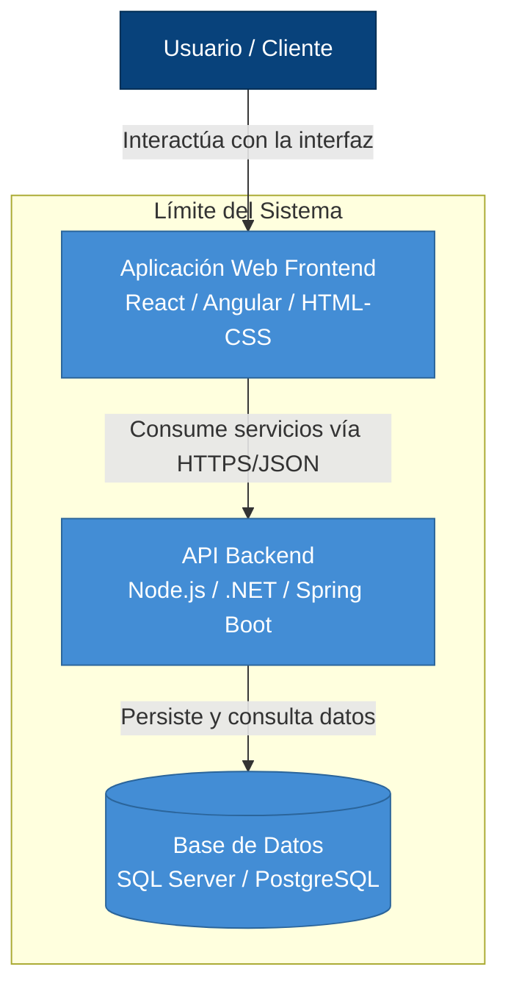

```mermaid
graph TD
 
    UserCont["Usuario / Cliente"]
 
    subgraph SistemaTIC["Límite del Sistema"]
        WebApp["Aplicación Web Frontend\nReact / Angular / HTML-CSS"]
        API["API Backend\nNode.js / .NET / Spring Boot"]
        DB[("Base de Datos\nSQL Server / PostgreSQL")]
    end
 
    UserCont -->|Interactúa con la interfaz| WebApp
    WebApp -->|Consume servicios vía HTTPS/JSON| API
    API -->|Persiste y consulta datos| DB
 
    classDef azulOscuro fill:#08427B,stroke:#032F55,color:#fff;
    classDef contenedor fill:#438DD5,stroke:#2B659B,color:#fff;
 
    class UserCont azulOscuro;
    class WebApp,API,DB contenedor;
```
