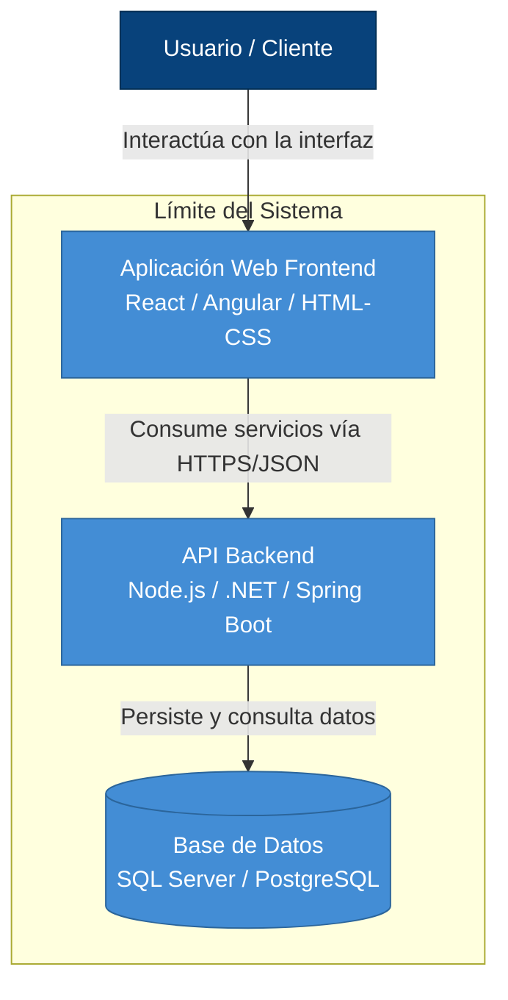

# Modelo C4

## Nivel 2: Modelo de Contenedores

### Descripción

En el **Nivel 2 – Modelo de Contenedores** se muestra cómo está organizado internamente el **Sistema de Información TIC** y cuáles son sus principales contenedores tecnológicos.

En este nivel, el **Usuario / Cliente** interactúa directamente con la **Aplicación Web Frontend**, que corresponde a la parte visual del sistema. Esta interfaz puede estar desarrollada utilizando tecnologías como **React, Angular o HTML, CSS y JavaScript**.

La **Aplicación Web Frontend** se comunica con la **API Backend** mediante servicios web, utilizando protocolos como **HTTPS** y formatos de intercambio de información como **JSON**.

El **Backend** es responsable de procesar las solicitudes, ejecutar la lógica del sistema y gestionar las operaciones necesarias.

Por otra parte, la **API Backend** se comunica con la **Base de Datos**, donde se almacenan y consultan los datos utilizados por el sistema. Como ejemplos de tecnologías para la base de datos se pueden utilizar **SQL Server** o **PostgreSQL**.

---

## Contenedores principales

| Contenedor | Descripción | Tecnologías posibles |
|---|---|---|
| Aplicación Web Frontend | Proporciona la interfaz visual mediante la cual el usuario interactúa con el sistema. | React, Angular, HTML, CSS y JavaScript |
| API Backend | Procesa las solicitudes, ejecuta la lógica del sistema y gestiona las operaciones. | Node.js, .NET, Spring Boot |
| Base de Datos | Almacena y permite consultar la información utilizada por el sistema. | SQL Server, PostgreSQL |

---

## Límite del Sistema

El rectángulo denominado **"Límite del Sistema"** permite identificar cuáles componentes forman parte directamente del **Sistema de Información TIC**.

Dentro de este límite se encuentran:

- **Aplicación Web Frontend**
- **API Backend**
- **Base de Datos**

El **Usuario / Cliente** se encuentra fuera del límite porque representa una persona que utiliza el sistema, pero no forma parte de sus componentes internos.

---

