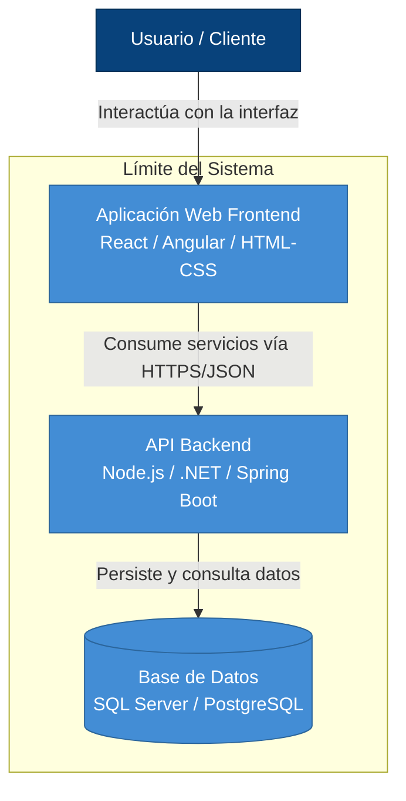

Nivel 2: Modelo de Contenedores
Descripción

En este nivel se observa que el Usuario o Cliente interactúa directamente con la Aplicación Web Frontend, que corresponde a la parte visual del sistema. Esta interfaz puede estar desarrollada utilizando tecnologías como React, Angular o HTML, CSS y JavaScript.

La Aplicación Web Frontend se comunica con la API Backend mediante servicios web utilizando protocolos como HTTPS y formatos de intercambio de información como JSON. El Backend es responsable de procesar las solicitudes, ejecutar la lógica del sistema y gestionar las operaciones necesarias.

Por otra parte, la API Backend se comunica con la Base de Datos, donde se almacenan y consultan los datos utilizados por el sistema. Como ejemplos de tecnologías para la base de datos se pueden utilizar SQL Server o PostgreSQL.

Límite del sistema

El rectángulo denominado "Límite del Sistema" permite identificar cuáles componentes forman parte directamente del Sistema de Información TIC. Dentro de este límite se encuentran:

Aplicación Web Frontend
API Backend
Base de Datos
Flujo de información

El diagrama representa el flujo general de comunicación de la siguiente manera:

Usuario → Frontend → Backend/API → Base de Datos

Interpretación

Este modelo permite comprender cómo está organizado internamente el sistema y cómo se comunican sus principales partes, sin llegar todavía al nivel de detalle de clases o componentes de programación.

