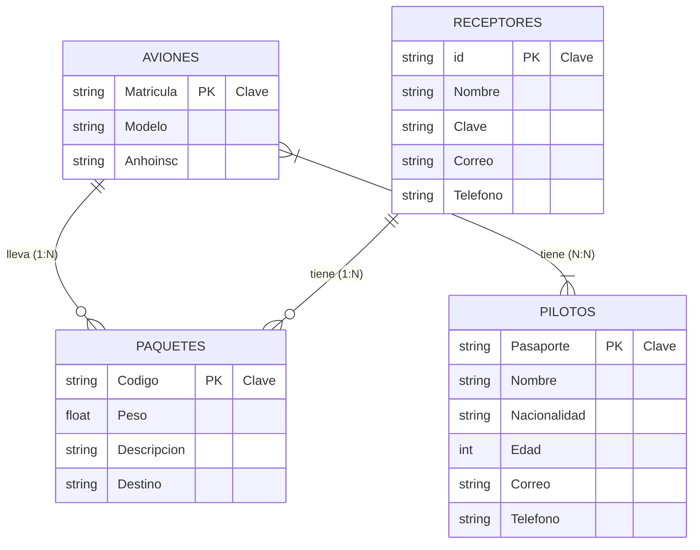

```mermaid
erDiagram
    AVIONES {
        string Matricula PK "Clave"
        string Modelo
        string Anhoinsc
    }

    PILOTOS {
        string Pasaporte PK "Clave"
        string Nombre
        string Nacionalidad
        int Edad
        string Correo
        string Telefono
    }

    PAQUETES {
        string Codigo PK "Clave"
        float Peso
        string Descripcion
        string Destino
    }

    RECEPTORES {
        string id PK "Clave"
        string Nombre
        string Clave
        string Correo
        string Telefono
    }

    AVIONES ||--o{ PAQUETES : "lleva (1:N)"
    AVIONES }|--|{ PILOTOS : "tiene (N:N)"
    RECEPTORES ||--o{ PAQUETES : "tiene (1:N)"
```
