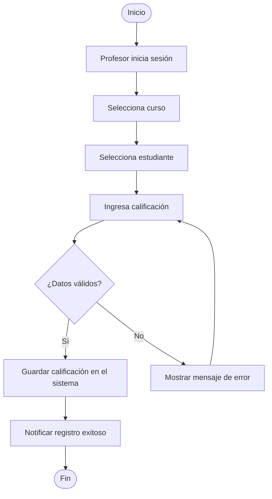

# Diagrama de Actividades - Registrar Calificación (SGCE)

```mermaid
flowchart TD
    A([Inicio]) --> B[Profesor inicia sesión]
    B --> C[Selecciona curso]
    C --> D[Selecciona estudiante]
    D --> E[Ingresa calificación]
    E --> F{¿Datos válidos?}
    F -- Sí --> G[Guardar calificación en el sistema]
    G --> H[Notificar registro exitoso]
    H --> I([Fin])
    F -- No --> J[Mostrar mensaje de error]
    J --> E
```