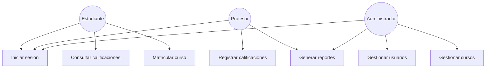

# Diagrama de Casos de Uso - SGCE

```mermaid
graph TD
    Estudiante((Estudiante))
    Profesor((Profesor))
    Administrador((Administrador))

    UC1[Iniciar sesión]
    UC2[Consultar calificaciones]
    UC3[Registrar calificaciones]
    UC4[Matricular curso]
    UC5[Generar reportes]
    UC6[Gestionar usuarios]
    UC7[Gestionar cursos]

    Estudiante --> UC1
    Estudiante --> UC2
    Estudiante --> UC4

    Profesor --> UC1
    Profesor --> UC3
    Profesor --> UC5

    Administrador --> UC1
    Administrador --> UC6
    Administrador --> UC7
    Administrador --> UC5
```