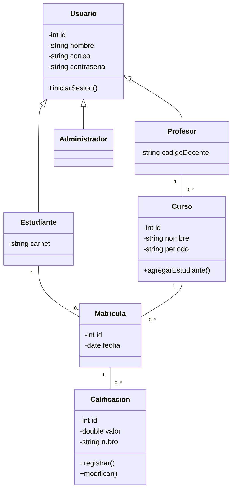

# Diagrama de Clases - SGCE

```mermaid
classDiagram
    class Usuario {
        -int id
        -string nombre
        -string correo
        -string contrasena
        +iniciarSesion()
    }

    class Estudiante {
        -string carnet
    }

    class Profesor {
        -string codigoDocente
    }

    class Administrador

    class Curso {
        -int id
        -string nombre
        -string periodo
        +agregarEstudiante()
    }

    class Matricula {
        -int id
        -date fecha
    }

    class Calificacion {
        -int id
        -double valor
        -string rubro
        +registrar()
        +modificar()
    }

    Usuario <|-- Estudiante
    Usuario <|-- Profesor
    Usuario <|-- Administrador

    Estudiante "1" -- "0..*" Matricula
    Curso "1" -- "0..*" Matricula
    Profesor "1" -- "0..*" Curso
    Matricula "1" -- "0..*" Calificacion
```