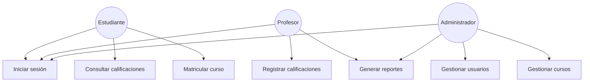
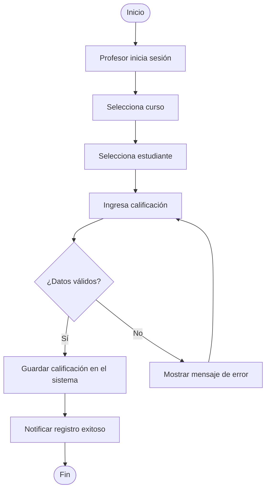
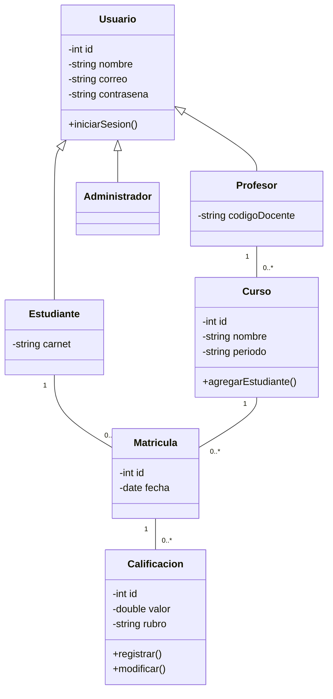

# Diagramas UML del Sistema

## Descripción General
Este documento presenta los diagramas UML desarrollados para el Sistema de Gestión de Calificaciones Escolares (SGCE). Se incluyen tres diagramas complementarios que permiten comprender el sistema desde diferentes perspectivas: los actores y sus interacciones, el flujo de un proceso clave y la estructura estática de las clases.

## Diagrama de Casos de Uso

### Descripción
Este diagrama representa las funcionalidades del sistema desde la perspectiva de los diferentes tipos de usuario. Permite identificar qué puede hacer cada actor dentro del sistema y sirve como base para definir los requisitos funcionales.

### Actores
- **Estudiante**: usuario que consulta su información académica y gestiona su matrícula.
- **Profesor**: usuario responsable de registrar y dar seguimiento a las calificaciones de sus cursos.
- **Administrador**: usuario encargado de la gestión general del sistema.

### Casos de uso principales
- Iniciar sesión (común a los tres actores)
- Consultar calificaciones (Estudiante)
- Matricular curso (Estudiante)
- Registrar calificaciones (Profesor)
- Generar reportes (Profesor, Administrador)
- Gestionar usuarios (Administrador)
- Gestionar cursos (Administrador)

### Representación

## Diagrama de Actividad

### Descripción
Este diagrama detalla el flujo del proceso de registro de una calificación por parte del profesor, incluyendo el punto de decisión donde se valida la información ingresada antes de guardarla en el sistema.

### Flujo del proceso
1. El profesor inicia sesión en el sistema.
2. Selecciona el curso correspondiente.
3. Selecciona al estudiante.
4. Ingresa la calificación.
5. El sistema valida los datos ingresados.
6. Si los datos son válidos, la calificación se guarda y se notifica el registro exitoso.
7. Si los datos no son válidos, se muestra un mensaje de error y se regresa al paso de ingreso de calificación.

### Representación

## Diagrama de Clases

### Descripción
Este diagrama muestra la estructura estática del sistema: las clases principales, sus atributos, métodos y las relaciones entre ellas. Se utiliza herencia para representar los diferentes tipos de usuario y asociaciones para modelar la matrícula y el registro de calificaciones.

### Clases principales

**Usuario** (clase base)
- Atributos: id, nombre, correo, contraseña
- Métodos: iniciarSesion()

**Estudiante** (hereda de Usuario)
- Atributos: carnet

**Profesor** (hereda de Usuario)
- Atributos: codigoDocente

**Administrador** (hereda de Usuario)

**Curso**
- Atributos: id, nombre, periodo
- Métodos: agregarEstudiante()

**Matricula**
- Atributos: id, fecha

**Calificacion**
- Atributos: id, valor, rubro
- Métodos: registrar(), modificar()

### Relaciones
- Estudiante, Profesor y Administrador heredan de Usuario.
- Un Estudiante puede tener múltiples Matrículas (1 a 0..*).
- Un Curso puede tener múltiples Matrículas (1 a 0..*).
- Un Profesor puede impartir múltiples Cursos (1 a 0..*).
- Una Matrícula puede tener múltiples Calificaciones asociadas (1 a 0..*).

### Representación
